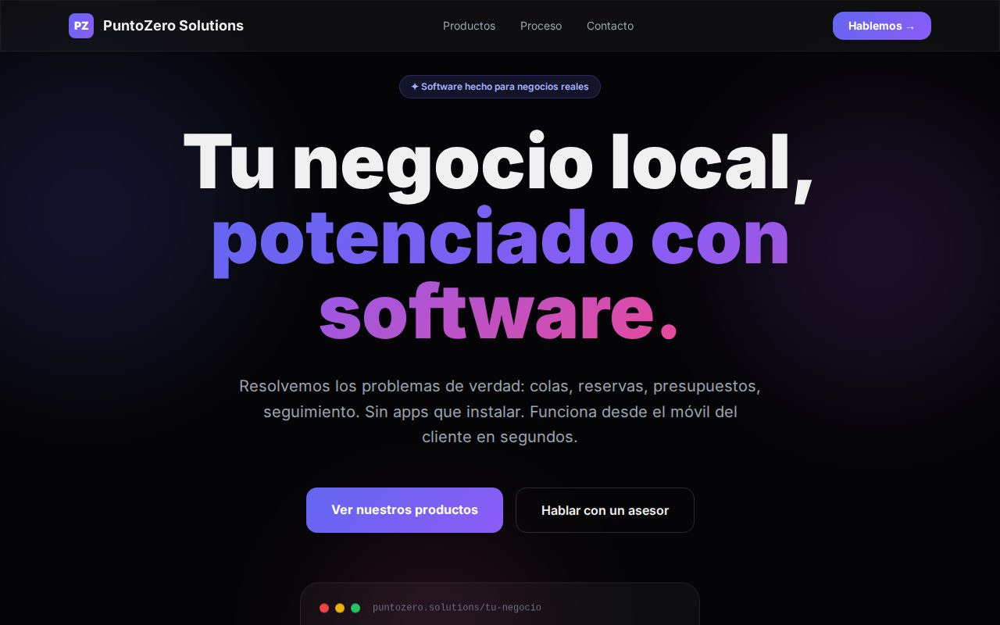

# PuntoZero Showcase

Escaparate de las soluciones de software de PuntoZero para negocios locales.

🔗 **[dario-acosta-sanchez.github.io/puntozero-showcase](https://dario-acosta-sanchez.github.io/puntozero-showcase/)**

## Qué incluye

- Catálogo de productos por tipo de negocio
- Explicación del proceso de trabajo
- Contacto por WhatsApp

## Tecnologías

  

---

Parte de [PuntoZero](https://puntozerosl.es).
